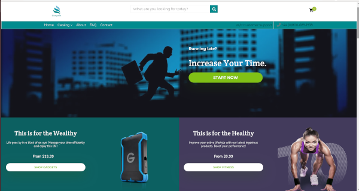

## Motivation

I've always wanted to make a change in this world. But I didn't know how until I started [DanPrix.com](https://danprix.com).

I’ve realised that there’s always going to be a demand for products that either save time, money or bring happiness into other people’s lives. 

For that reason, I decided to start an [online store](https://danprix.com) where anyone in this world would be able to find products which can improve a part of their life and help them become more efficient, as I’m a strong believer that __**efficiency is the key towards success**__.

<iframe width="560" height="315" src="https://www.youtube.com/embed/_XkiRd3kPQc" frameborder="0" allow="accelerometer; autoplay; encrypted-media; gyroscope; picture-in-picture" allowfullscreen></iframe>

## How I Started

It all began when I watched a very inspirational webinar from [Alex Becker](https://alexbecker.org/) where he talked about escaping the 9-to-5 rat race and avoiding the insurmountable pain of dying without fulfilling your dreams. 

That was the turning point in my life, because after the webinar I decided I didn't want to be like everyone else, and instead I wanted to become extraordinary so that one day I would achieve my biggest goals.

I started by investing all the money I had into the best Shopify [Dropshipping](https://www.shopify.co.uk/guides/dropshipping/understanding-dropshipping) course (at that time) and I made a commitment to do whatever it takes in order to become successful one day.

When I first started out, I didn't know how to build complex websites such as an eCommerce, so I went online, did a bit of research and found out that [Shopify](https://www.shopify.com/) had this amazing tool which allowed me to build a website with just a few clicks. In this way, I could focus on building the brand and finding the best products for my customers, instead of spending weeks building the website from scratch.

In the meantime, I was doing the [H-COM 3030 Shopify Dropshipping course](https://paykstrt.com/8858/33085) where I learned about:

* Dropshipping
* Print on Demand
* Delivering extraordinary service
* Addressing customer pain points
* Doing business differently than competitors
* Focusing on a narrow niche
* Creating powerful offers and guarantees
* Many more...

After going through all the great content by watching videos and talking to other peers in the private Facebook group, it was time to take massive action and see if the course was any good.

I contacted one of my best friends and told him about my idea to create a unique online store where people all around the world could find affordable products that save money, time and improve the quality of their life.

He really loved the idea as much as I did and he was to become the co-founder of [DanPrix.com](https://danprix.com).

## More People === More Power

With Raul Finaru joining the team, we were able to speed up the launching process and create wonderful stories for our products. While Raul was writing the copy for the tens of products on our website, I was working on creating a memorable user experience (UX) and finding new innovative products that aligned with our mission.

This process was very tedious, because there are millions of products on the Internet and our job was to find the ones that were:

<li id="criteria">Innovative</li>
<li>High-quality</li>
<li>Could not be found at a general store (i.e: Walmart, Tesco, etc.)</li>
<li>Solved a problem</li>
<li>Trending (people were willing to buy)</li>
<li>Allowing for profitability (good margins)...</li>

...because at the end of the day our business needed to survive.

In terms of User Experience (UX), I decided to throw the classic Shopify theme away and use a *premium, scalable and high-converting* theme instead which allowed DanPrix.com to stand out above anything else.

Although that came with a cost, I believe it was a good investment, because I was able to save a lot of time (not having to write the code myself) and improve the look and feel of the website significantly.

## The Launch

After spending hundreds of hours:

* Learning business
* Finding products
* Writing copy
* Building the website
* Improving the UX/UI
* Creating a strong Social Media presence
* and having fun while doing it (we really enjoyed being entrepreneurs)...

...We finally were ready to go live and watch how thousands of people around the world would order our products and we'd become self-made millionaires.

But, as you've probably already guessed, that didn't happen.

For quite a long period of time we didn't make any sales. And that was exactly what we'd anticipated. Now, we needed to figure out what was going wrong and how it could be improved.

## Advertising

For a business to succeed and be profitable, it needs customers. 

DanPrix didn't make any sales during the initial launch because there was no traffic on the website.

**People didn't know about DanPrix!**

Once I learned about Facebook Ads and how to find people on Facebook that were interested in exactly what I was selling, then everything (should have) became easier.

The average product we were selling cost $30 and we'd make a profit of roughly $10.

Had I set a daily advertising budget of $10 and waited three days until I made a sale, I would have lost $20, which was not what I was looking for.

**Quick Note:** If you don't know how Facebook Ads work, [check out this article](https://neilpatel.com/blog/deep-dive-facebook-advertising/).

Shortly put, the more money someone spends in a day on a Facebook Ad, the more people that Ad will reach.

So, my strategy was to set a daily budget of $25, wait a day and then decide whether to remove, update or leave it run for another two days, until a full three day cycle was completed.

Although costly initially, this strategy was **very** good because it allowed me to test many products in a very short period of time, which was 
crucial to our fast-paced business.

## The First Sale

Using the Advertising strategy mentioned above, I was able to test one different product every day.

Measuring the performance of each Ad was crucial to determining whether to keep an Ad running - hence spend more money - or change/delete it.

We had many failures. There were countless products we thought were great and met all the criterias discussed [here](#criteria) but turned out to make no sales...

And it was extremly difficult to detect what determined people not to buy.

* Was the ad copy wrong?
* Was the target audience wrong? 
* Was the product wrong?
* Was the product page wrong?

...and many other questions we didn't know the answer to.

However, with patience and constantly improving our approach, we finally managed to find a product that got a sale.

**Congratulations to us!!!**

But that was it. One sale.

No more, no less.

Why ? Probably because of the ad copy, target audience, product, product page, or website.

## Running Out Of Money

After many failures, eventually me and my partner have run out of money and we couldn't afford to pay for the Facebook Ads anymore.

The one big mistake I made when deciding to start this business was not taking into account how much money I would need to have before the business started to kick off.

I didn't think of the worst case scenario and I had a strong belief the store would soon start to make sales, but that wasn't true.

If I were to start again, I would make a very consistent business plan and I would make I have at least $10,000 to spend on Advertising.

## Live Demo

If you want to see our website, it's available at: [www.danprix.com](https://danprix.com)