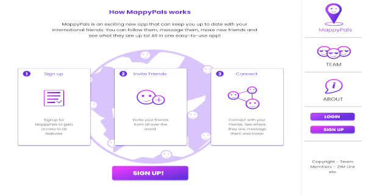

## Overview

**An app that keeps track of your friends by putting them on a map**

Our mission is to make it easier for people (travelers, students) to connect with like-minded people abroad.

MappyPals is a collaboration project managed by a small group of dedicated fellow students. Building an application to provide users a platform to keep track of which countries their friends and family are in, to make meeting up an easier task.

MappyPals is being built upon the MERN stack, with the intention of releasing and maintaining the project in the real world based upon user suggestions and feedback. Therefore providing an awesome opportunity not only the ability to expand on and learn new skills, but also a project you can include on your resume and show off to friends, family and potential employers.

## Objectives

* To make travelling easier by connecting travellers to the people they know in a particular city.
* To connects travellers with similar interest (interest feature).
* To help build travelling ituneraries.

## Functionalities

### Version 1.0

* User Authentication (Login/Register)
* CRUD Friends
* Display friends on a map based on their { country: ‘Azerbaijan’ };
* Click on friend icon to view more details.

### Version 2.0

* Send out emails to added friends to join the platform
* Friends can update their profile which should reflect across the entire app
* Auto update friends new location (permission) which should reflect across the app
* See your friend’s friends (mutual friends)

## Tools

* **Frontend**: React, CSS3
* **Backend**: Node, MongoDB with Mongoose
* **Map API**: MapBox, Google Maps

## Github Repo

If you would like to find out more about this project, or see my contributions, check out this repo: https://github.com/danielgnz/mappypals

**Note**: I've also contributed to the **backend** repo, which can be found here: https://github.com/danielgnz/mappypals_backend